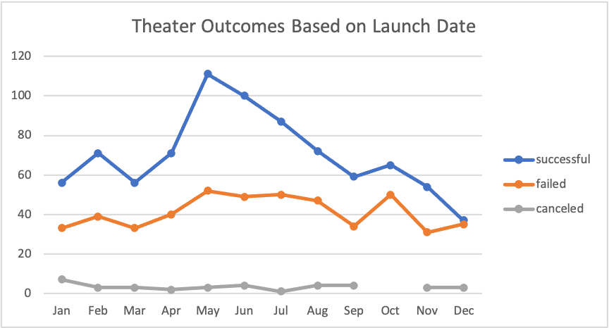
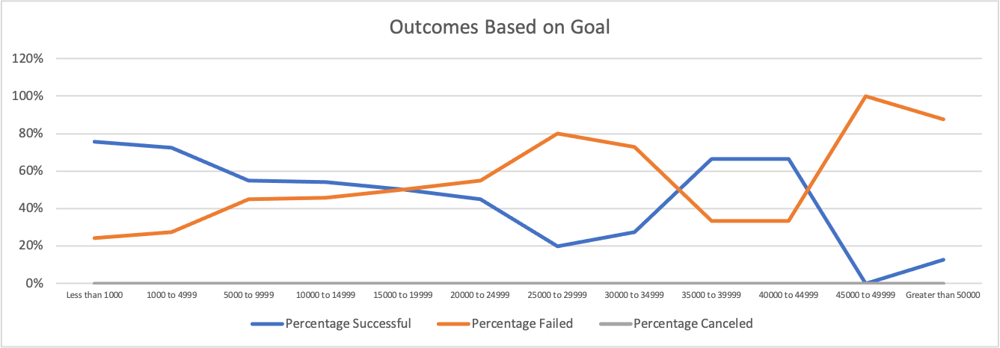

# Kickstarting with Excel

## Overview of Project

### Purpose
The purpose of this project is to help Louis, a playwright, to plan her crowdfunding campaign (with an estimated budget of over $10,000) to help her play (Fever). In this project, I used Excel to sort and analyze the crowdfunding data with more than 4000 crowdfunding projects to determine the factors that could make her campaign successful.
## Analysis and Challenges
### Analysis of Outcomes Based on Launch Date

In this section, I analyzed the relationship between the number of successful, failed, and canceled campaign for theater category with month of the year. 
From the chart, we can clearly see that the peak of successful campaign is happened in May, while the highest number of failed Kickstarter campaigns are happened in May, July and October. 

### Analysis of Outcomes Based on Goals

In this section, I analyzed the relationship between the percetage of successful, failed, and canceled campaign for Play category with the amount of goals. The percentage of successful is the highest when the goal is less than $1,000, and the overall successful rate is decreasing with the increasing of amount of goal. Interestingly, the successful rate starts to rise to around 70% with a relatively lower percentage of failed when the goal range is from $35,000 to $44,999. When the goal is greater than $45,000, the percentage of successful starts to decline dramatically.

### Challenges and Difficulties Encountered
The biggest challenge was to figure out the possible factors that may influence the success of crowdfunding campaign. Because we need to analyze the data and sort the data based on the hypothesis that we’ve made. If we didn’t make a good hypothesis, or list the practical factors, then our analysis could be meaningless, as well as more time-consuming. Therefore, I think figuring out the possible factors before the analysis is sometimes more important than the analysis itself. The way I would overcome this challenge is to do research and know deeper about the background of the project that we are going to deal with. In this case, I would research: “what factors may cause crowdfunding campaign fails”, before I start to do the analysis.

## Results

- Two conclusions about the Outcomes based on Launch Date.

From the outcomes vs launch date chart, we see that the highest number of successful campaign is happened in May. Although the number of failed campaigns is also relatively high in May, the difference between number of successful and failed campaign is the largest. Therefore, we can conclude that the chance of success would be larger if Louis hold her campaign in May. 

The second conclusion is that start the campaign from the middle of the year is the best, while start the campaign in the end of the year is the worst. Because the number of successful campaigns begins to decrease toward to the end of the year, also, the number of successful campaign and failed campaign are almost same in December.

- Conclusion about the Outcomes based on Goals.

From the outcomes based on goal chart, we can conclude that the overall trend of successful rate is higher with a lower amount of goal, and the failed rate is proportional to the goal amount.  However, the successful rate cannot be only determined by amount of goal because according to the chart, percentage of successful starts to increase when the goal reaches to $35000. There must be some other factors that cause this raise in successful rate, such as the duration of the campaign, and the location of the campaign.

- Summary of the limitations of the dataset, and recommendation for additional tables and graphs.

The limitations of the datasets are:
1. The dataset is not large enough for all categories of the campaigns. 
2. The dataset does not include the way of each campaign hold, such as the compensation of each person who participate in this crowdfunding campaign, because this is the key reason may influence the donor’s decision.

Recommendation for additional tables and graphs:

A graph that shows the relationship between the duration of the campaign and the percentage of successful campaign.
